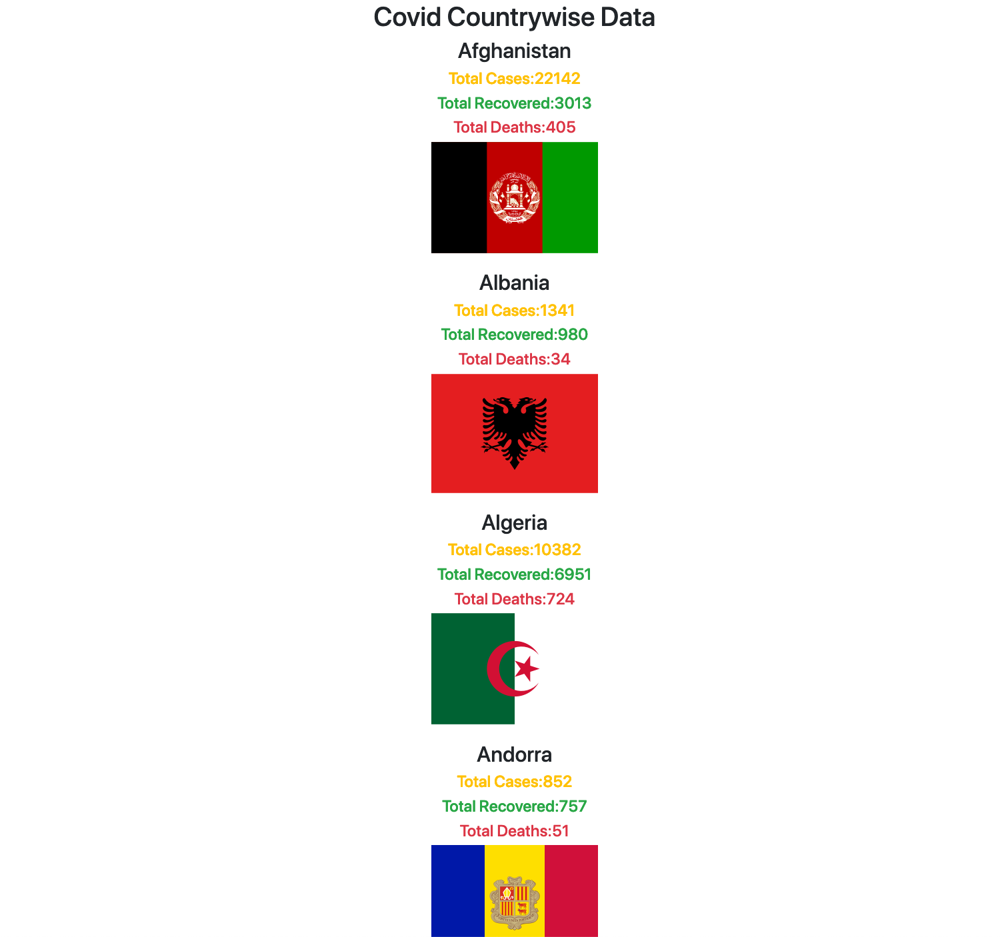

# CoranaStatus
Just a test to get the status on Corana data

To test the current day covid data we use the novelcovid lib to fetch and show the data.

1. Do fetch the code, and run npm install.
2. On terminal, do a npm start
3. View current updated data on http://localhost:5000/countries

Can we be extended to more with two day data , full list of data for each countries further. This is just a beginning.

